Streamdown includes built-in support for [Mermaid](https://mermaid.js.org/) diagrams, allowing you to create flowcharts, sequence diagrams, state diagrams, and more using simple text-based syntax. Each diagram includes interactive controls for fullscreen viewing, downloading, and copying.

Mermaid is loaded on-demand from a CDN only when a diagram is rendered, keeping your initial bundle size small. By default, Mermaid loads from `https://www.streamdown.ai/cdn`. See [Offline Mode](/docs/offline-mode) for self-hosting options.

**Note:** Mermaid requires CDN access to function. If you set `cdnUrl={null}` to disable CDN loading, Mermaid diagrams will not render.

## Basic Usage

Create Mermaid diagrams using code blocks with the `mermaid` language identifier:

````markdown
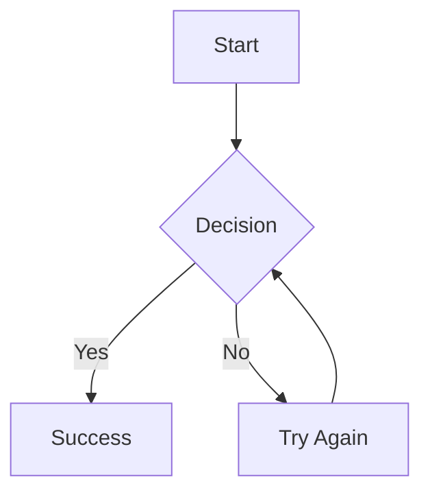
````

Streamdown will render the diagram as an interactive SVG with controls.

## Diagram Types

### Flowcharts

Create flowcharts to visualize processes and workflows:

````markdown
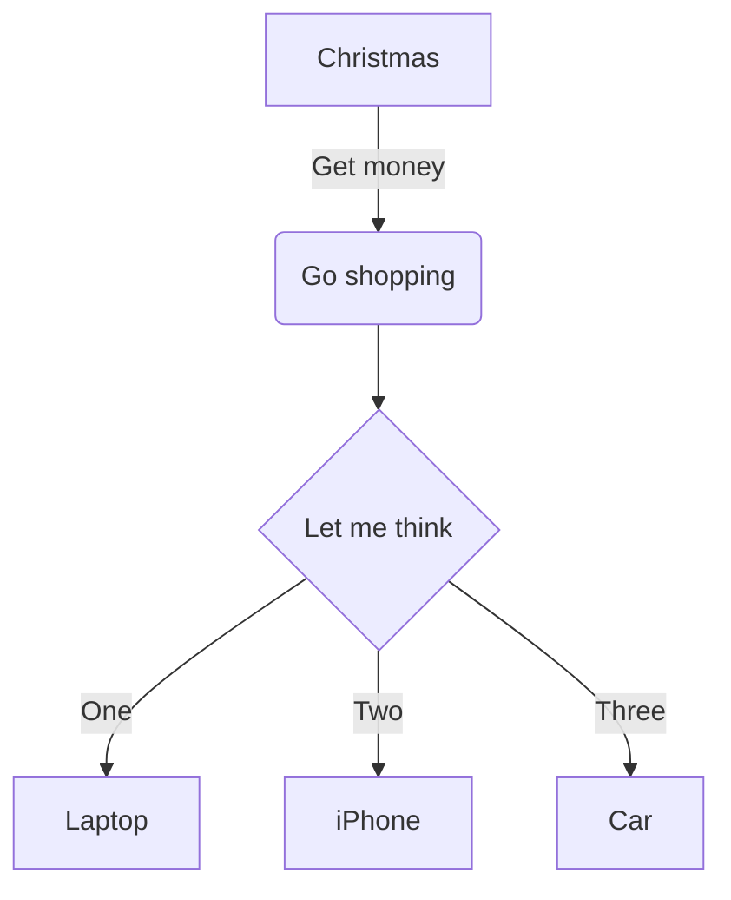
````

**Node Shapes:**
- `[text]` - Rectangle
- `(text)` - Rounded rectangle
- `{text}` - Rhombus (decision)
- `((text))` - Circle
- `[[text]]` - Subroutine shape

**Direction:**
- `graph TD` - Top to bottom
- `graph LR` - Left to right
- `graph BT` - Bottom to top
- `graph RL` - Right to left

### Sequence Diagrams

Visualize interactions between different actors or systems:

````markdown
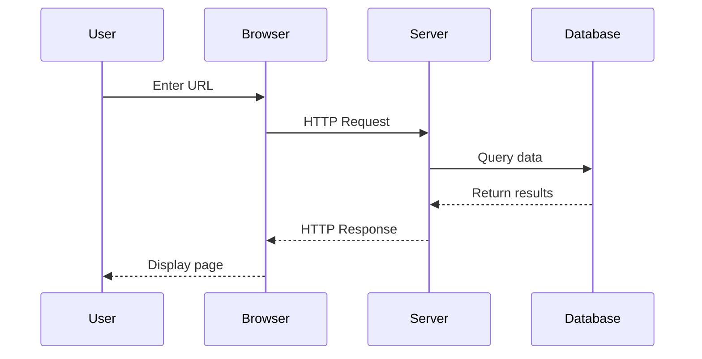
````

**Arrow Types:**
- `->` - Solid line
- `-->` - Dotted line
- `->>` - Solid arrow
- `-->>` - Dotted arrow

### State Diagrams

Model state machines and state transitions:

````markdown
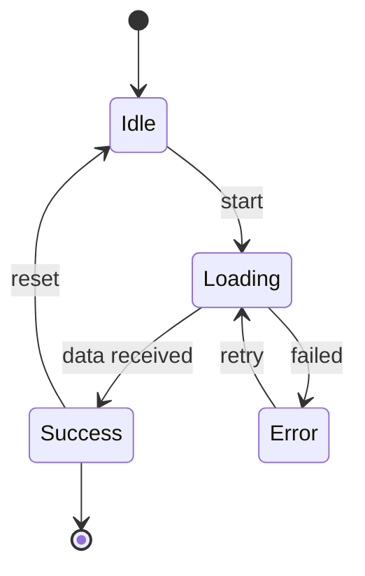
````

### Class Diagrams

Document object-oriented designs:

````markdown
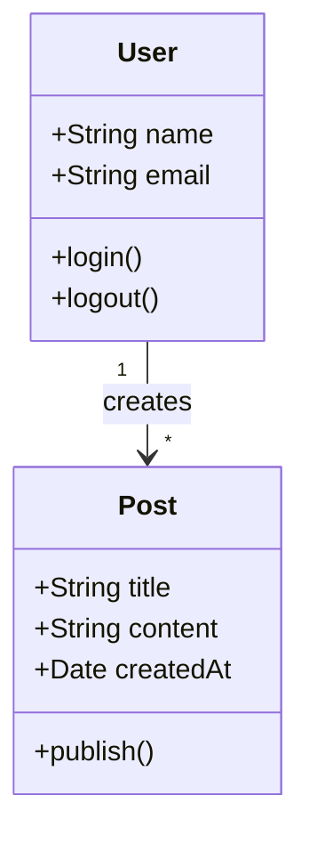
````

### Pie Charts

Display proportional data:

````markdown
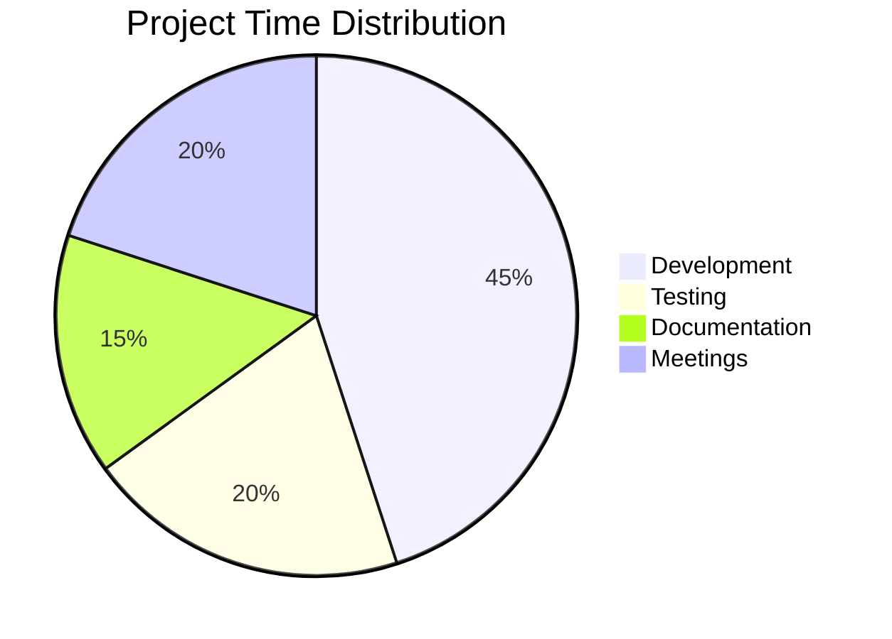
````

### Gantt Charts

Plan and track project timelines:

````markdown
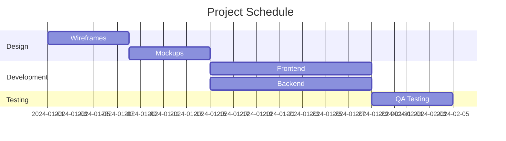
````

### Entity Relationship Diagrams

Model database relationships:

````markdown
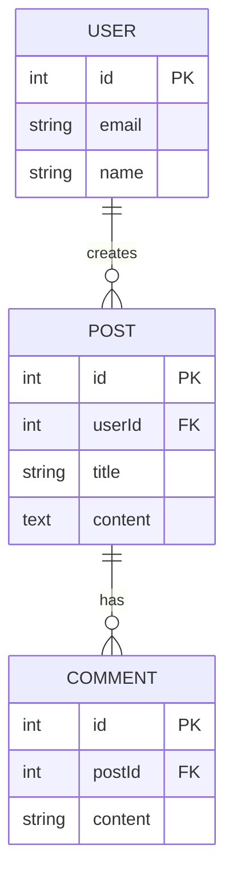
````

### Git Graphs

Visualize Git workflows:

````markdown
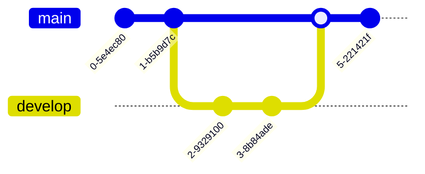
````

## Configuration

### Theme Customization

Customize the Mermaid theme using the `mermaid.config` prop:

```tsx
import { Streamdown } from 'streamdown';
import type { MermaidConfig } from 'streamdown';

export default function Page() {
  return (
    <Streamdown
      mermaid={{
        config: {
          theme: 'dark',
          themeVariables: {
            primaryColor: '#ff6b6b',
            primaryTextColor: '#fff',
            primaryBorderColor: '#ff6b6b',
            lineColor: '#f5f5f5',
            secondaryColor: '#4ecdc4',
            tertiaryColor: '#45b7d1'
          }
        }
      }}
    >
      {markdown}
    </Streamdown>
  );
}
```

### Available Themes

Mermaid includes several built-in themes:

- `default` - Classic Mermaid theme
- `dark` - Dark mode optimized
- `forest` - Green tones
- `neutral` - Minimal styling
- `base` - Clean, modern style

Example:

```tsx
<Streamdown mermaid={{ config: { theme: 'forest' } }}>
  {markdown}
</Streamdown>
```

### Advanced Configuration

Customize specific diagram types:

```tsx
<Streamdown
  mermaid={{
    config: {
      theme: 'base',
      themeVariables: {
        fontSize: '16px',
        fontFamily: 'Inter, sans-serif',
      },
      flowchart: {
        nodeSpacing: 50,
        rankSpacing: 50,
        curve: 'basis',
      },
      sequence: {
        actorMargin: 50,
        boxMargin: 10,
        boxTextMargin: 5,
      },
    }
  }}
>
  {markdown}
</Streamdown>
```

## Error Handling

### Custom Error Component

When Mermaid diagrams fail to render due to invalid syntax, you can provide a custom error component instead of displaying the default error message. This is especially useful for production environments where you want to control the user experience.

```tsx
import { Streamdown } from 'streamdown';
import type { MermaidErrorComponentProps } from 'streamdown';

const CustomMermaidError = ({ error, chart, retry }: MermaidErrorComponentProps) => (
  <div className="rounded-lg border border-amber-200 bg-amber-50 p-4">
    <div className="flex items-center gap-2">
      <span className="text-xl">⚠️</span>
      <p className="font-semibold text-amber-900">Couldn't render diagram</p>
    </div>
    <p className="mt-2 text-amber-700 text-sm">
      There was an issue with the diagram syntax.
    </p>
    <button
      onClick={retry}
      className="mt-3 rounded bg-amber-600 px-4 py-2 text-white text-sm hover:bg-amber-700"
    >
      Try Again
    </button>
  </div>
);

export default function Page() {
  return (
    <Streamdown
      mermaid={{
        errorComponent: CustomMermaidError
      }}
    >
      {markdown}
    </Streamdown>
  );
}
```

The error component receives three props:

- **error** (`string`) - The error message from Mermaid
- **chart** (`string`) - The original Mermaid diagram code
- **retry** (`() => void`) - Function to retry rendering the diagram

### Error Component Benefits

- **Production-ready** - Hide technical error details from end users
- **Custom branding** - Style errors to match your application
- **Better UX** - Provide helpful actions like retry buttons or support links
- **Debugging control** - Log errors to your monitoring service

### Example: Logging Errors

```tsx
const ErrorWithLogging = ({ error, chart, retry }: MermaidErrorComponentProps) => {
  useEffect(() => {
    // Log to your error tracking service
    console.error('Mermaid rendering failed:', error);
    // Could also send to Sentry, LogRocket, etc.
  }, [error]);

  return (
    <div className="text-center p-4">
      <p className="text-muted-foreground">Unable to display diagram</p>
      <button onClick={retry} className="mt-2 text-primary text-sm underline">
        Retry
      </button>
    </div>
  );
};
```

## Interactive Controls

Each Mermaid diagram includes interactive controls:

### Fullscreen Mode

Click the fullscreen button to view the diagram in an overlay with a dark background. This is especially useful for complex diagrams.

### Download

Download the diagram as an SVG file for use in presentations or documentation.

### Copy

Copy the diagram to your clipboard for pasting into other applications.

### Customizing Controls

You can customize which controls are shown:

```tsx
<Streamdown
  controls={{
    mermaid: {
      fullscreen: true,
      download: true,
      copy: true,
    }
  }}
>
  {markdown}
</Streamdown>
```

Or disable specific controls:

```tsx
<Streamdown
  controls={{
    mermaid: {
      fullscreen: true,
      download: false,  // Hide download button
      copy: false,      // Hide copy button
    }
  }}
>
  {markdown}
</Streamdown>
```

Or disable all Mermaid controls:

```tsx
<Streamdown controls={{ mermaid: false }}>
  {markdown}
</Streamdown>
```

## Streaming Considerations

### Initial Render

When Mermaid diagrams are first streamed in, they appear as code blocks until the diagram syntax is complete. Streamdown's parser ensures the code block is properly formatted during streaming.

### Disable Interactions During Streaming

Use the `isAnimating` prop to disable interactive controls while content is streaming:

```tsx
<Streamdown isAnimating={isStreaming}>
  {markdown}
</Streamdown>
```

This prevents users from interacting with incomplete diagrams.

## Best Practices

### Keep Diagrams Focused

Break complex diagrams into smaller, focused visualizations:

````markdown
✅ Good: Multiple small diagrams

## User Authentication Flow
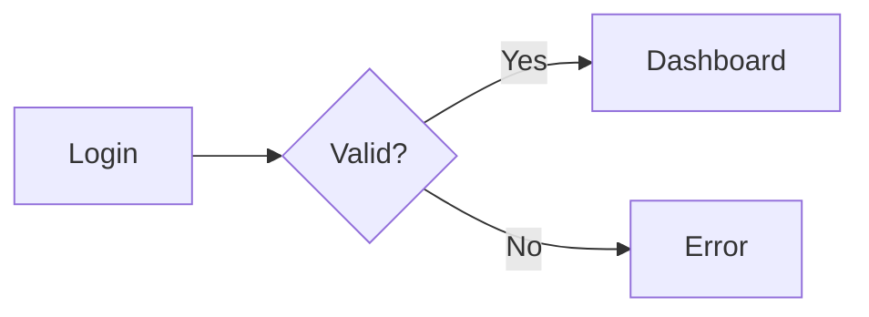

## Data Fetching Flow
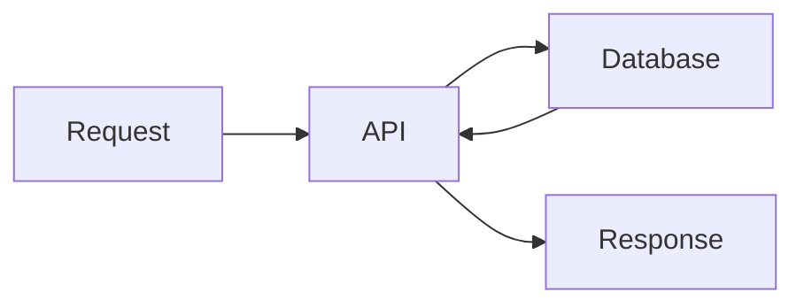

❌ Avoid: One massive diagram with everything
````

### Add Context

Provide descriptions for your diagrams:

````markdown
Here's the authentication flow for our application:

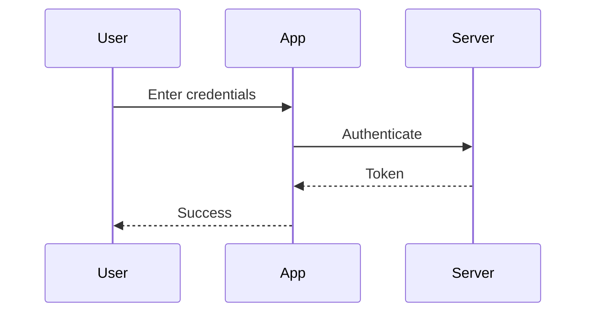

The server validates credentials and returns a JWT token.
````

### Use Descriptive Labels

Make your diagrams self-documenting:

````markdown
✅ Good: Clear labels
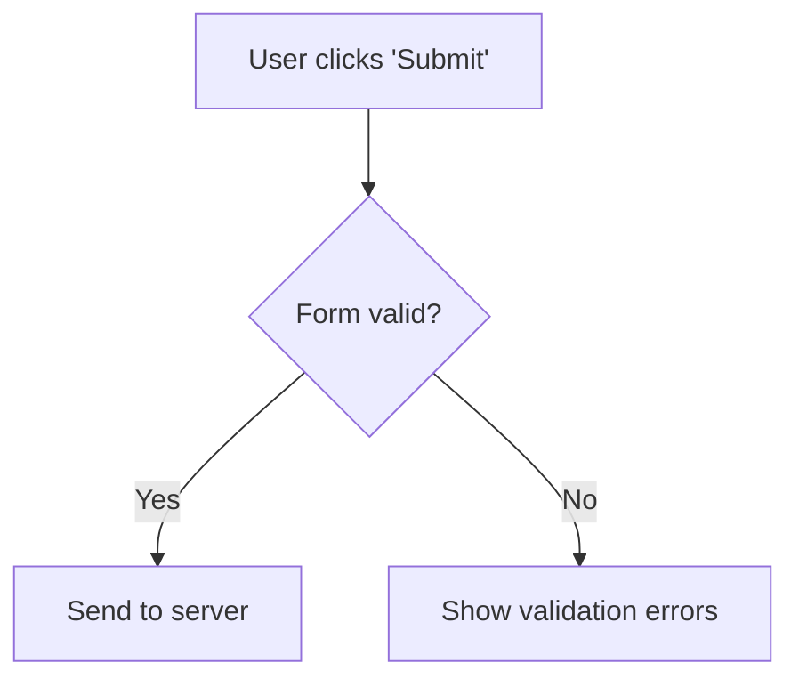

❌ Avoid: Cryptic labels
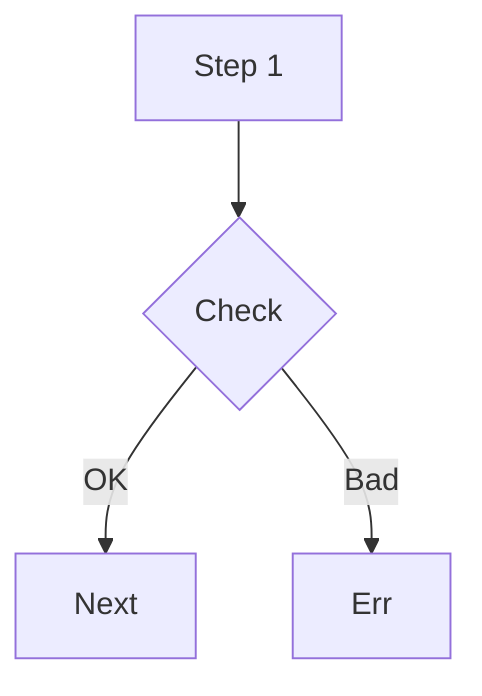
````

### Choose the Right Diagram Type

Select the diagram type that best represents your information:

- **Flowchart** - Processes, algorithms, workflows
- **Sequence** - API interactions, communication flows
- **State** - Lifecycle, state machines
- **Class** - Object relationships, architecture
- **ER** - Database schemas
- **Gantt** - Project timelines
- **Pie/Bar** - Statistical data

## Syntax Reference

### Flowchart Links

```
A --> B         // Arrow
A --- B         // Line
A -.-> B        // Dotted arrow
A ==> B         // Thick arrow
A -->|Label| B  // Labeled arrow
```

### Sequence Diagram Actors

```
participant A as Alice
actor B as Bob
```

### Styling Nodes

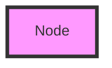

### Subgraphs

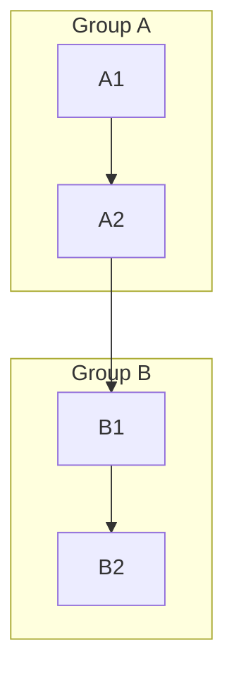

## Common Issues

### Diagram Not Rendering

1. Verify the syntax is correct (check [Mermaid Live Editor](https://mermaid.live/))
2. Ensure the code block uses `` ```mermaid ``
3. Check browser console for JavaScript errors
4. Verify Mermaid is not being blocked by CSP

### Performance with Large Diagrams

Large diagrams may take time to render. Consider:

- Breaking into smaller diagrams
- Simplifying node relationships
- Using subgraphs for organization
- Lazy loading diagram-heavy pages

### Theme Not Applying

1. Verify `mermaidConfig` is properly passed
2. Check that theme name is spelled correctly
3. Ensure custom theme variables are valid

## Resources

- [Mermaid Documentation](https://mermaid.js.org/intro/) - Official docs
- [Mermaid Live Editor](https://mermaid.live/) - Test diagrams online
- [Syntax Reference](https://mermaid.js.org/intro/syntax-reference.html) - Complete syntax guide
- [Mermaid Examples](https://mermaid.js.org/ecosystem/integrations.html) - Gallery of examples

## Related Features

- [Code Blocks](/docs/code-blocks) - Syntax highlighting for other code
- [GitHub Flavored Markdown](/docs/gfm) - Extended Markdown features
- [Typography](/docs/typography) - Text styling around diagrams
- [Unterminated Block Parsing](/docs/termination) - How streaming works with Mermaid
